# Next Journey

## 👥 Miembros del Equipo
| Nombre y Apellidos | Correo URJC | Usuario GitHub |
|:--- |:--- |:--- |
| David Gutiérrez Oviedo | d.gutierrezo.2023@alumnos.urjc.es | davidgutierrezovi18 |
| Mari Luz Charfolé Maestro | ml.charfole.2024@alumnos.urjc.es | Mluzcm |
| Hugo Rus González | h.rus.2023@alumnos.urjc.es | hurg05 |
| Nerea Sanz Sobrados | n.sanz.2024@alumnos.urjc.es | nsanz2024 |

---


## 🎭 **Preparación: Definición del Proyecto**

### **Descripción del Tema**
Nuestra idea es una aplicación web de gestión de viajes personales. Permite a los usuarios registrar los viajes que han realizado, planificar futuros viajes, subir fotos y documentos de itinerarios, y valorar destinos turísticos. La plataforma ayuda a los usuarios a organizar sus experiencias de viaje y compartir opiniones con otros usuarios, fomentando la planificación y el descubrimiento de nuevos destinos.

### **Entidades**
-Usuario: Representa a los usuarios de la web (registrados y administrador).

-Destino: Lugares o ciudades a los que los usuarios pueden viajar.

-Viaje: Registro de un viaje realizado o planificado por un usuario a un destino, cada viaje tendrá un fichero pdf con el intinerario del viaje.

-Valoración: Opiniones de los usuarios sobre los destinos, incluyendo puntuación y comentarios (Los comentarios tendrán texto enriquecido).


**Relaciones entre entidades:**

Usuario - Viaje: Un usuario puede tener múltiples viajes (1:N).

Viaje - Destino: Un viaje puede tener múltiples destinos (1:N).

Usuario - Valoración: Un usuario puede valorar múltiples lugares (1:N).

Destino - Valoración: Un destino puede tener múltiples valoraciones (1:N).

Viaje - Plan de Viaje: Un viaje puede tener un plan asociado con ficheros o notas (1:1).


### **Permisos de los Usuarios**
Usuario Anónimo:

   Permisos: Visualización de destinos y valoraciones públicas, búsqueda de destinos.
   No es dueño de ninguna entidad.

Usuario Registrado:

   Permisos: Crear, editar y borrar sus propios viajes y valoraciones; subir fotos y planes de viaje;    personalizar perfil.
   Es dueño de: Sus propios viajes, valoraciones, planes de viaje y perfil de usuario.

Administrador:

   Permisos: Gestión completa de usuarios, destinos, valoraciones y viajes; moderación de contenido.
   Es dueño de: Todos los viajes, valoraciones, destinos y usuarios.

Imágenes

   Usuario: Avatar o foto de perfil. 
   Destino: Imagen representativa del destino.
   Viaje: Imagen representativa del viaje.

Viaje: Múltiples fotos asociadas al viaje.
---

## 🛠 **Práctica 1: Maquetación de páginas con HTML y CSS**

### **Vídeo de Demostración**
📹 **[Enlace al vídeo en YouTube](https://www.youtube.com/watch?v=x91MPoITQ3I)**
> Vídeo mostrando las principales funcionalidades de la aplicación web.

### **Diagrama de Navegación**
Diagrama que muestra cómo se navega entre las diferentes páginas de la aplicación:

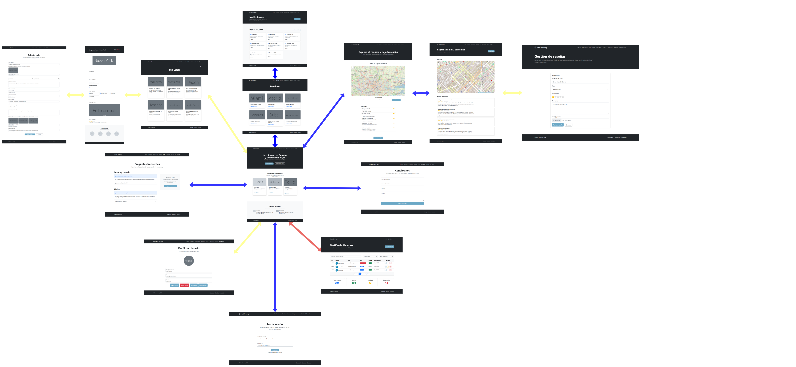

>Diagrma con las principales paginas de la web, Usuarios registrados (Amarillo), Usuarios sin registrar (Azul), Administrador (Rojo)

### **Capturas de Pantalla y Descripción de Páginas**

#### **1. Página principal - Inicio (índex.html)**
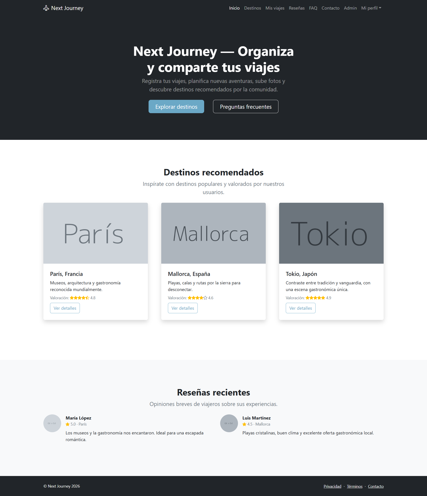

>Página de inicio que muestra destinos recomendados y reseñas recientes. Incluye barra de navegación y botones para explorar destinos y ver las preguntas frecuentes.

#### **2. Página de destinos (destinations.html)**
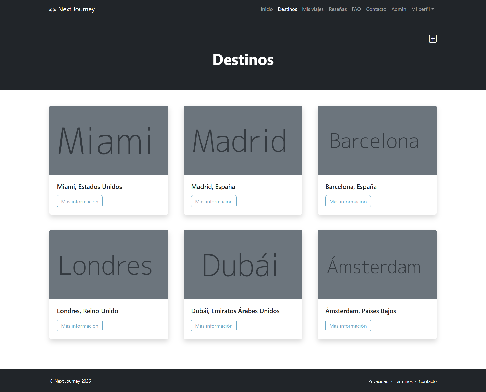

>Página en la que se muestran diferentes destinos añadidos, permitiendo ir a la página de un destino concreto. Incluye barra de navegación y botón para crear un nuevo destino.

#### **3. Página de un destino (one_destination.html)**
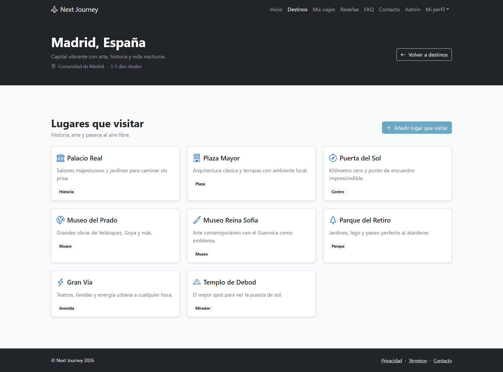

>Página que muestra un destino al completo, con lugares que se pueden visitar. Incluye barra de navegación, botón para añadir lugares a visitar, y para volver a la página de destinos.

#### **4. Página de añadir destino (add_destination.html)**
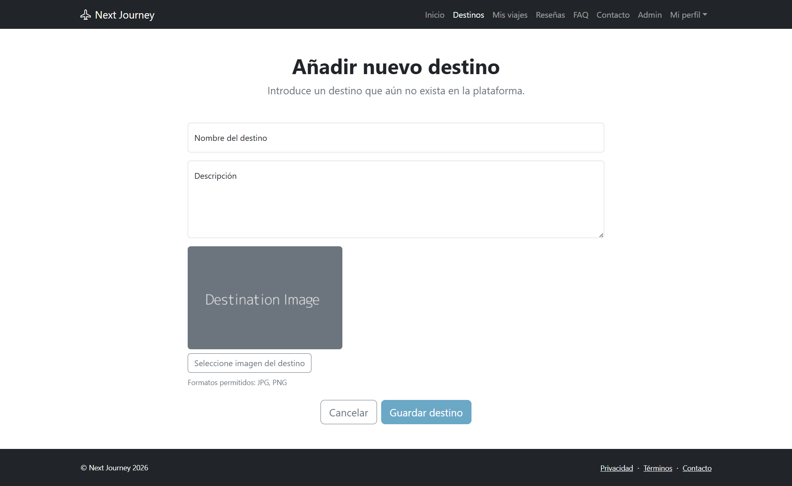

>Formulario para añadir un nuevo destino; requiere los campos: nombre, descripción e imagen. Incluye barra de navegación, botón de cancelar, y de enviar el formulario.

#### **5. Página de añadir lugar a visitar (add_place.html)**


>Formulario para añadir un nuevo lugar a visitar; requiere los campos: nombre, descripción y categoría. Incluye barra de navegación, botón de cancelar, y de enviar el formulario.

#### **6. Página mis viajes (mytravels.html)**
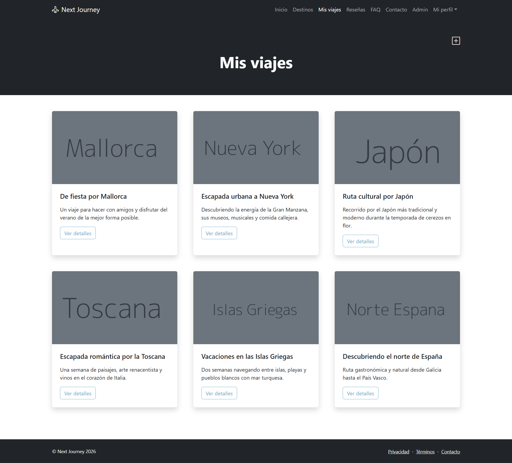

>Página en la que se muestran los viajes del usuario registrado, permitiendo ir a la página de un viaje concreto. Incluye barra de navegación y botón para crear un nuevo viaje.

#### **7. Página de un viaje (one_travel.html)**
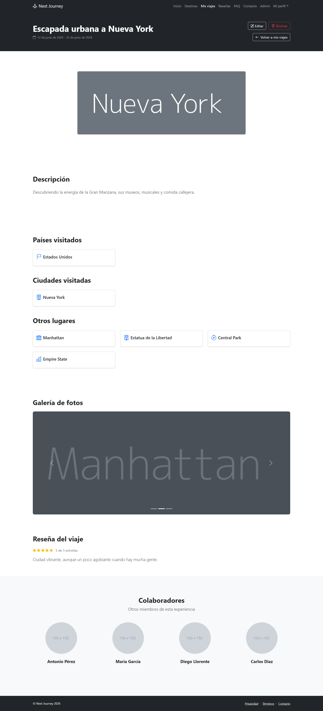

>Página que muestra un viaje al completo (título, descripción, imágenes, colaboradores…). Incluye barra de navegación, botón para editar el viaje, eliminar el viaje y volver a la página “mis viajes”.

#### **8. Página de añadir viaje (create_new_travel.html)**


>Formulario para añadir un nuevo viaje; con los campos: nombre, descripción, imagen, fechas, países visitados, ciudades visitadas, lugares visitados, calificación, comentario, imágenes, pdf del itinerario, y miembros del viaje (algunos campos son obligatorios). Incluye barra de navegación, botón de cancelar, y de enviar el formulario.

#### **9. Página de editar viaje (edit_travel.html)**


>Página que permite editar los distintos campos rellenados al crear un viaje. Incluye barra de navegación, botón de cancelar, y de guardar cambios. 

#### **10. Página de reseñas (reviews.html)**
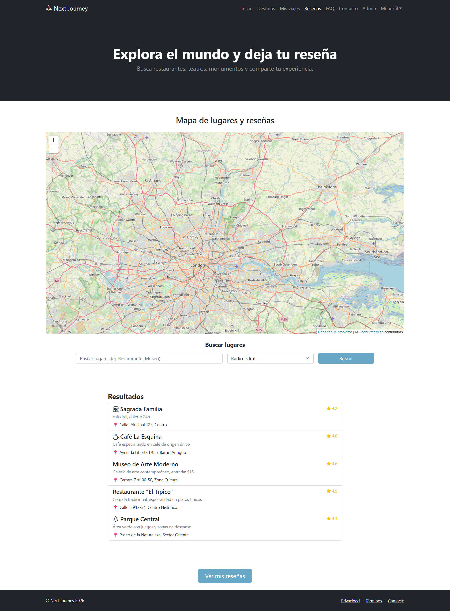

>Página que muestra un mapa y algunos lugares ya reseñados en los que si haces click te lleva a ellos. Ademas, también permite buscar otros lugares. Incluye barra de navegación, y botón para ver tus propias reseñas.

#### **11. Página mis reseñas (my_reviews.html)**
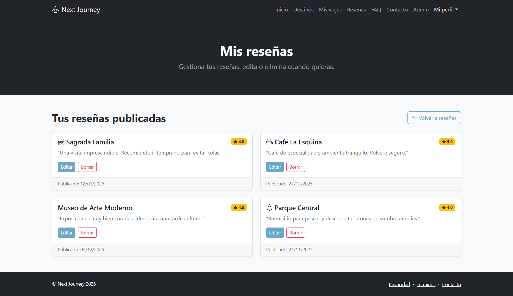

>Página desde la que se pueden ver todas las reseñas realizadas por el usuario registrado. Además, se pueden editar y borrar las reseñas. Incluye barra de navegación, y botón para volver a la página “reseñas”.

#### **12. Página de crear (add-review.html)**


>Formulario para añadir una nueva reseña; requiere los campos: nombre, tipo, puntuación, y foto. Incluye barra de navegación, botón de cancelar, y de enviar el formulario.

#### **13. Página para dejar una reseña (place_reviews.html)**
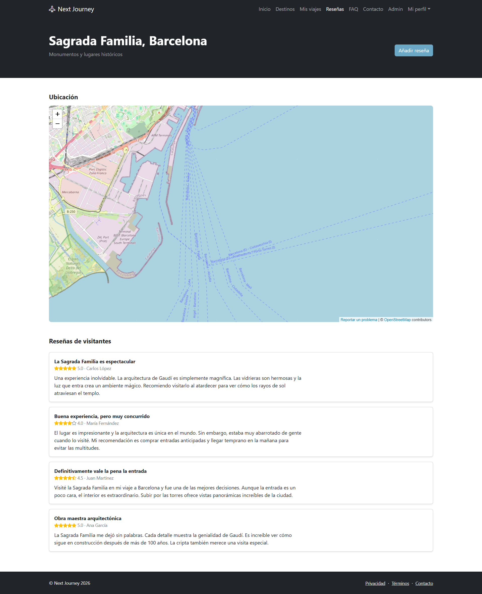

>Página para ver las reseñas de un lugar determinado y su ubicación en un mapa. Incluye barra de navegación, y botón para añadir una reseña.

#### **14. Página de preguntas frecuentes (faq.html)**
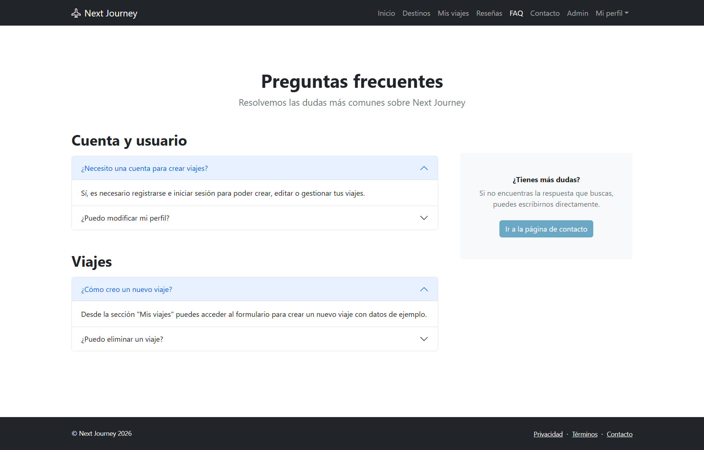

>Página en la que se pueden consultar las respuestas a preguntas frecuentes realizadas por los usuarios. Incluye barra de navegación, y botón para ir a la página de contacto.

#### **15. Página de contacto (contact.html)**
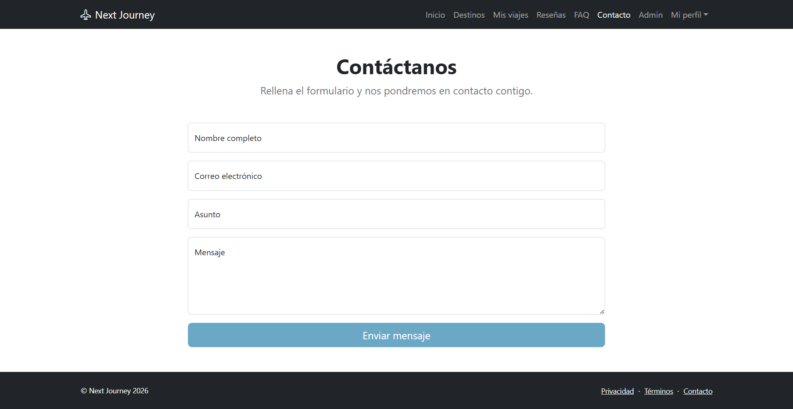

>Página que permite rellenar un formulario para contactar con los propietarios de la web. Incluye barra de navegación y botón para enviar el formulario.

#### **16.⁠ ⁠Página de ver perfil (user_profile.html)**
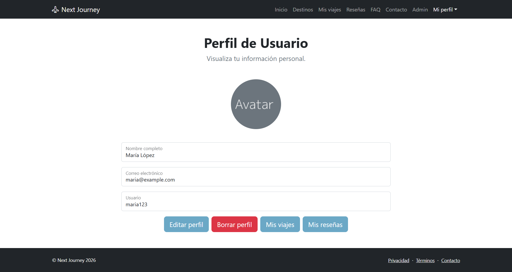

>Página en la que se muestra el perfil del usuario, nombre, correo y nombre de usuario. Incluye barra de navegación, botón para editar perfil, botón para borrar perfil, botón para volver a mis viajes y botón para ver las reseñas de usuario. 

#### **17.  Página de iniciar sesión (sign_in.html)**
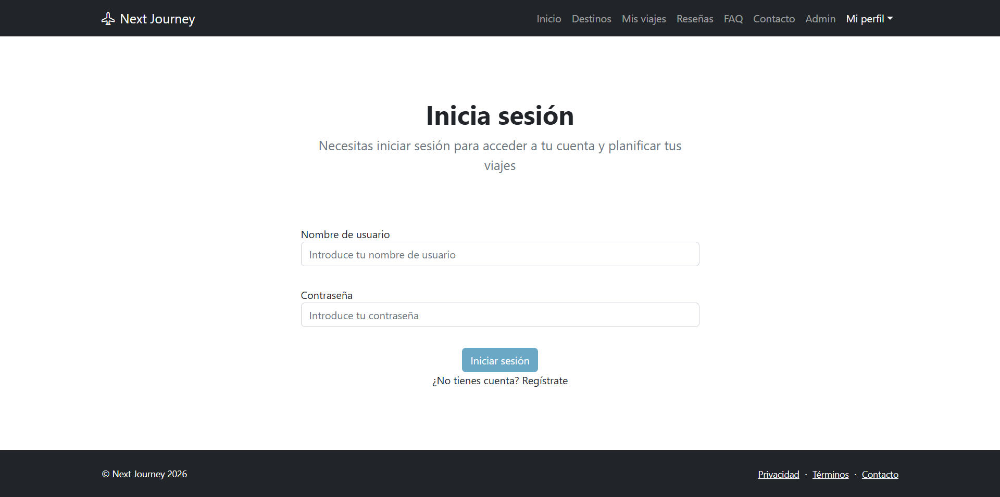

>Formulario para poder acceder a tu cuenta, contiene los campos nombre de usuario y contraseña . Incluye barra de navegación, botón para iniciar sesión y link para poder registrarse por si el usuario todavía no estaba registrado

#### **18.⁠ ⁠Pagina Registrarse (register.html)**
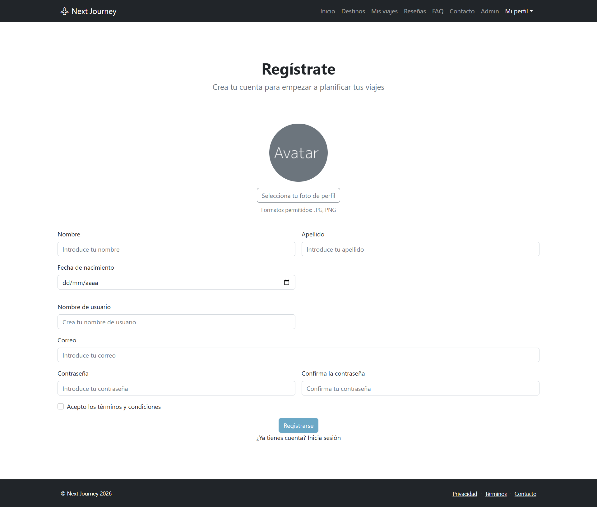

>Formulario para poder crear una cuenta, contiene los campos, nombre, apellido, fecha de nacimiento, correo, contraseña,  confirmar contraseña y botón para aceptar los términos y condiciones. Incluye barra de navegación y link para poder iniciar sesión por si el usuario ya esta registrado.

#### **19.⁠ ⁠Página de admin  (admin_users.html)**
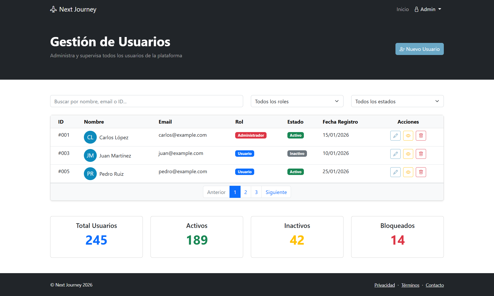

>Página en la cual el admin puede gestionar a los demás usuarios, editarlos, ver su perfil, eliminarlos y añadir nuevos usuarios. Contiene barras de búsqueda por nombre, email o Id, por roles y por estados. En la pagina también se puede ver el total de Usuarios, los activos los inactivos y los bloqueados. Incluye barra de navegación para poder volver al inicio y cerrar sesión admin.

#### **20. Página de editar perfil de usuario (edit_profile.html)**
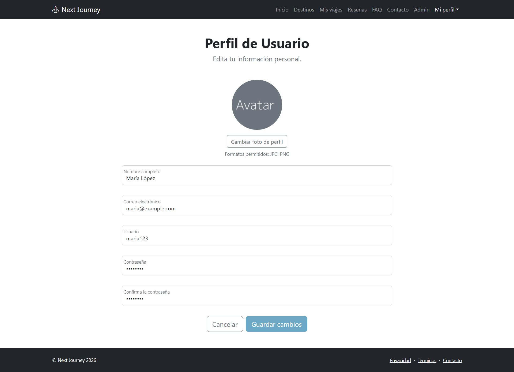

>Página que permite editar los distintos campos asociados a un perfil de usuario. Incluye barra de navegación, botón de cancelar, y de guardar cambios.


### **Participación de Miembros en la Práctica 1**

#### **Alumno 1 - David Gutiérrez Oviedo**

Creación de las paginas relacionadas con las reviews

| Nº    | Commits      | Files      |
|:------------: |:------------:| :------------:|
|1| [Review Pages](https://github.com/DWS-2026/dws-2026-project-base/commit/ece5804d1c80ef8b10fa41a13de77ea1697cef54)  | [reviews.html](https://github.com/DWS-2026/project-grupo-4/blob/main/reviews.html) [place_reviews.html](https://github.com/DWS-2026/project-grupo-4/blob/main/place_reviews.html)  |
|2| [add-review](https://github.com/DWS-2026/dws-2026-project-base/commit/15b2ebabe82ddb41e5185e83b4f51172ea739112)  | [add-review.hmtl](https://github.com/DWS-2026/project-grupo-4/blob/main/add-review.html)   |
|3| [Update admin page and footer](https://github.com/DWS-2026/dws-2026-project-base/commit/0d42f29a39b8f9430fdbeb08432a1a4cb82b0fdc)  | [admin_user.html](https://github.com/DWS-2026/project-grupo-4/blob/main/admin_users.html)   |
|4| [Creation of index](https://github.com/DWS-2026/dws-2026-project-base/commit/f4e680038ea6ae6114a50e8370fcdf42ccf890a4)  | [index.html](https://github.com/DWS-2026/project-grupo-4/blob/main/index.html)   |
|5| [Add option view my reviews](https://github.com/DWS-2026/dws-2026-project-base/commit/665c0d8186aa747ea0b7727c9a31544552021eaa)  | [my_reviews.html](https://github.com/DWS-2026/project-grupo-4/blob/main/my_reviews.html)   |


---

#### **Alumno 2 - Mari Luz Charfolé Maestro**

Creación y desarrollo de las páginas relacionadas con los viajes, además de la base para la barra de navegación. También algunas modificaciones en el css base.

| Nº    | Commits      | Files      |
|:------------: |:------------:| :------------:|
|1| [Creation new travel](https://github.com/DWS-2026/project-grupo-4/commit/1d88d6c6eb6394f73e8503940d4f424f5cba0070)  | [create_new_travel.html](https://github.com/DWS-2026/project-grupo-4/blob/main/create_new_travel.html)   |
|2| [Creation of edition page of one published travel](https://github.com/DWS-2026/dws-2026-project-base/commit/530a8bf5e1299feafb811344898672371bbfa5ea)  | [edit_travel.html](https://github.com/DWS-2026/project-grupo-4/blob/main/edit_travel.html)   |
|3| [Creation of my travels page ](https://github.com/DWS-2026/dws-2026-project-base/commit/eff9e7d7f782d7adfe459ce825d6ceb3c69dc548)  | [mytravels.html](https://github.com/DWS-2026/project-grupo-4/blob/main/mytravels.html)   |
|4| [Creation of one travel page](https://github.com/DWS-2026/dws-2026-project-base/commit/0d4e704e3c84a8c87f28324716aa8ba2e0a2f169)  | [one_travel.html](https://github.com/DWS-2026/project-grupo-4/blob/main/one_travel.html)   |
|5| [Creation of the base of the navigation bar](https://github.com/DWS-2026/dws-2026-project-base/commit/c31855d188c1b2208719bf3fedb4d120f9dceab8)  | todos los archivos   |

---

#### **Alumno 3 - Hugo Rus González**

Desarrollo de algunas de las principales páginas de la aplicación (incluyendo perfil de usuario, páginas de soporte y la mayoría de páginas de destino) y grabación del vídeo demostrativo.

| Nº    | Commits      | Files      |
|:------------: |:------------:| :------------:|
|1| [Creation user profile](https://github.com/DWS-2026/dws-2026-project-base/commit/421068b3f1fd8f9a37c0f252feb2bcb2b3d62c13)  | [user_profile.html](https://github.com/DWS-2026/project-grupo-4/blob/main/user_profile.html)   |
|2| [Creation of contact page](https://github.com/DWS-2026/dws-2026-project-base/commit/2673041eabdda67e2b1ce241c2b85a7de401be1e)  | [contact.html](https://github.com/DWS-2026/project-grupo-4/blob/main/contact.html)   |
|3| [Creation of add destination and add place](https://github.com/DWS-2026/dws-2026-project-base/commit/1cdabb3a89703cf71dd783de0558688a3cce3174)  | [add_destination.html](https://github.com/DWS-2026/project-grupo-4/blob/main/add_destination.html) [add_place.html](https://github.com/DWS-2026/project-grupo-4/blob/main/add_place.html)  |
|4| [Creation of one_destination](https://github.com/DWS-2026/dws-2026-project-base/commit/848b195104fe9c07cf2406be5cd3315bf8015d88)  | [one_destination.html](https://github.com/DWS-2026/project-grupo-4/blob/main/one_destination.html)   |
|5| [Creation of faq page](https://github.com/DWS-2026/dws-2026-project-base/commit/befd32f94db86368d31d249e3770194412dbccea)  | [faq.html](https://github.com/DWS-2026/project-grupo-4/blob/main/faq.html)  |

---

#### **Alumno 4 - Nerea Sanz Sobrados**

Creación y desarrollo de las paginas de iniciar sesión y registrarse, de destinos y de editar perfil. Aparte también he modificado cosas puntuales de otras.

| Nº    | Commits      | Files      |
|:------------: |:------------:| :------------:|
|1| [Create register](https://github.com/DWS-2026/dws-2026-project-base/commit/92d7b42753c861f77a7726fa51ae385825891dd3) | [register.html](https://github.com/DWS-2026/project-grupo-4/blob/main/register.html) |
|2| [Create sign_in and modify register](https://github.com/DWS-2026/dws-2026-project-base/commit/32a38188872fbd7317fd4f3d2b6b6e5fa4945ee7)  | [sign_in.html](https://github.com/DWS-2026/project-grupo-4/blob/main/sign_in.html)   |
|3| [Create edit_profile and modify register](https://github.com/DWS-2026/dws-2026-project-base/commit/25f786b6bbc872f92068d8d2313fb7d0dfc5dc2e) | [edit_profile.html](https://github.com/DWS-2026/project-grupo-4/blob/main/edit_profile.html)   |
|4| [Create destinations](https://github.com/DWS-2026/dws-2026-project-base/commit/e1b30a39dc97d0d24e125dc63eee9203c82c3e9f) | [destinations.html](https://github.com/DWS-2026/project-grupo-4/blob/main/destinations.html)   |
|5| [Modify sign_in](https://github.com/DWS-2026/dws-2026-project-base/commit/32a38188872fbd7317fd4f3d2b6b6e5fa4945ee7)  | [sign_in.html](https://github.com/DWS-2026/project-grupo-4/blob/main/sign_in.html)   |

---

## 🛠 **Práctica 2: Web con HTML generado en servidor**

### **Vídeo de Demostración**
📹 **[Enlace al vídeo en YouTube](https://www.youtube.com/watch?v=x91MPoITQ3I)**
> Vídeo mostrando las principales funcionalidades de la aplicación web.

### **Navegación y Capturas de Pantalla**

#### **Diagrama de Navegación**

Solo si ha cambiado.

#### **Capturas de Pantalla Actualizadas**

Solo si han cambiado.

### **Instrucciones de Ejecución**

#### **Requisitos Previos**
- **Java**: versión 21 o superior
- **Maven**: versión 3.8 o superior
- **MySQL**: versión 8.0 o superior
- **Git**: para clonar el repositorio

#### **Pasos para ejecutar la aplicación**

1. **Clonar el repositorio**
   ```bash
   git clone https://github.com/[usuario]/[nombre-repositorio].git
   cd [nombre-repositorio]
   ```

2. **AQUÍ INDICAR LO SIGUIENTES PASOS**

#### **Credenciales de prueba**
- **Usuario Admin**: usuario: `admin`, contraseña: `admin`
- **Usuario Registrado**: usuario: `user`, contraseña: `user`

### **Diagrama de Entidades de Base de Datos**

Diagrama mostrando las entidades, sus campos y relaciones:


> [Descripción opcional: Ej: "El diagrama muestra las 4 entidades principales: Usuario, Producto, Pedido y Categoría, con sus respectivos atributos y relaciones 1:N y N:M."]

### **Diagrama de Clases y Templates**

Diagrama de clases de la aplicación con diferenciación por colores o secciones:


> [Descripción opcional del diagrama y relaciones principales]

### **Participación de Miembros en la Práctica 2**

#### **Alumno 1 - [Nombre Completo]**

[Descripción de las tareas y responsabilidades principales del alumno en el proyecto]

| Nº    | Commits      | Files      |
|:------------: |:------------:| :------------:|
|1| [Descripción commit 1](URL_commit_1)  | [Archivo1](URL_archivo_1)   |
|2| [Descripción commit 2](URL_commit_2)  | [Archivo2](URL_archivo_2)   |
|3| [Descripción commit 3](URL_commit_3)  | [Archivo3](URL_archivo_3)   |
|4| [Descripción commit 4](URL_commit_4)  | [Archivo4](URL_archivo_4)   |
|5| [Descripción commit 5](URL_commit_5)  | [Archivo5](URL_archivo_5)   |

---

#### **Alumno 2 - [Nombre Completo]**

[Descripción de las tareas y responsabilidades principales del alumno en el proyecto]

| Nº    | Commits      | Files      |
|:------------: |:------------:| :------------:|
|1| [Descripción commit 1](URL_commit_1)  | [Archivo1](URL_archivo_1)   |
|2| [Descripción commit 2](URL_commit_2)  | [Archivo2](URL_archivo_2)   |
|3| [Descripción commit 3](URL_commit_3)  | [Archivo3](URL_archivo_3)   |
|4| [Descripción commit 4](URL_commit_4)  | [Archivo4](URL_archivo_4)   |
|5| [Descripción commit 5](URL_commit_5)  | [Archivo5](URL_archivo_5)   |

---

#### **Alumno 3 - [Nombre Completo]**

[Descripción de las tareas y responsabilidades principales del alumno en el proyecto]

| Nº    | Commits      | Files      |
|:------------: |:------------:| :------------:|
|1| [Descripción commit 1](URL_commit_1)  | [Archivo1](URL_archivo_1)   |
|2| [Descripción commit 2](URL_commit_2)  | [Archivo2](URL_archivo_2)   |
|3| [Descripción commit 3](URL_commit_3)  | [Archivo3](URL_archivo_3)   |
|4| [Descripción commit 4](URL_commit_4)  | [Archivo4](URL_archivo_4)   |
|5| [Descripción commit 5](URL_commit_5)  | [Archivo5](URL_archivo_5)   |

---

#### **Alumno 4 - [Nombre Completo]**

[Descripción de las tareas y responsabilidades principales del alumno en el proyecto]

| Nº    | Commits      | Files      |
|:------------: |:------------:| :------------:|
|1| [Descripción commit 1](URL_commit_1)  | [Archivo1](URL_archivo_1)   |
|2| [Descripción commit 2](URL_commit_2)  | [Archivo2](URL_archivo_2)   |
|3| [Descripción commit 3](URL_commit_3)  | [Archivo3](URL_archivo_3)   |
|4| [Descripción commit 4](URL_commit_4)  | [Archivo4](URL_archivo_4)   |
|5| [Descripción commit 5](URL_commit_5)  | [Archivo5](URL_archivo_5)   |

---

## 🛠 **Práctica 3: Incorporación de una API REST a la aplicación web, análisis de vulnerabilidades y contramedidas**

### **Vídeo de Demostración**
📹 **[Enlace al vídeo en YouTube](https://www.youtube.com/watch?v=x91MPoITQ3I)**
> Vídeo mostrando las principales funcionalidades de la aplicación web.

### **Documentación de la API REST**

#### **Especificación OpenAPI**
📄 **[Especificación OpenAPI (YAML)](/api-docs/api-docs.yaml)**

#### **Documentación HTML**
📖 **[Documentación API REST (HTML)](https://raw.githack.com/[usuario]/[repositorio]/main/api-docs/api-docs.html)**

> La documentación de la API REST se encuentra en la carpeta `/api-docs` del repositorio. Se ha generado automáticamente con SpringDoc a partir de las anotaciones en el código Java.

### **Diagrama de Clases y Templates Actualizado**

Diagrama actualizado incluyendo los @RestController y su relación con los @Service compartidos:


#### **Credenciales de Usuarios de Ejemplo**

| Rol | Usuario | Contraseña |
|:---|:---|:---|
| Administrador | admin | admin123 |
| Usuario Registrado | user1 | user123 |
| Usuario Registrado | user2 | user123 |

### **Participación de Miembros en la Práctica 3**

#### **Alumno 1 - [Nombre Completo]**

[Descripción de las tareas y responsabilidades principales del alumno en el proyecto]

| Nº    | Commits      | Files      |
|:------------: |:------------:| :------------:|
|1| [Descripción commit 1](URL_commit_1)  | [Archivo1](URL_archivo_1)   |
|2| [Descripción commit 2](URL_commit_2)  | [Archivo2](URL_archivo_2)   |
|3| [Descripción commit 3](URL_commit_3)  | [Archivo3](URL_archivo_3)   |
|4| [Descripción commit 4](URL_commit_4)  | [Archivo4](URL_archivo_4)   |
|5| [Descripción commit 5](URL_commit_5)  | [Archivo5](URL_archivo_5)   |

---

#### **Alumno 2 - [Nombre Completo]**

[Descripción de las tareas y responsabilidades principales del alumno en el proyecto]

| Nº    | Commits      | Files      |
|:------------: |:------------:| :------------:|
|1| [Descripción commit 1](URL_commit_1)  | [Archivo1](URL_archivo_1)   |
|2| [Descripción commit 2](URL_commit_2)  | [Archivo2](URL_archivo_2)   |
|3| [Descripción commit 3](URL_commit_3)  | [Archivo3](URL_archivo_3)   |
|4| [Descripción commit 4](URL_commit_4)  | [Archivo4](URL_archivo_4)   |
|5| [Descripción commit 5](URL_commit_5)  | [Archivo5](URL_archivo_5)   |

---

#### **Alumno 3 - [Nombre Completo]**

[Descripción de las tareas y responsabilidades principales del alumno en el proyecto]

| Nº    | Commits      | Files      |
|:------------: |:------------:| :------------:|
|1| [Descripción commit 1](URL_commit_1)  | [Archivo1](URL_archivo_1)   |
|2| [Descripción commit 2](URL_commit_2)  | [Archivo2](URL_archivo_2)   |
|3| [Descripción commit 3](URL_commit_3)  | [Archivo3](URL_archivo_3)   |
|4| [Descripción commit 4](URL_commit_4)  | [Archivo4](URL_archivo_4)   |
|5| [Descripción commit 5](URL_commit_5)  | [Archivo5](URL_archivo_5)   |

---

#### **Alumno 4 - [Nombre Completo]**

[Descripción de las tareas y responsabilidades principales del alumno en el proyecto]

| Nº    | Commits      | Files      |
|:------------: |:------------:| :------------:|
|1| [Descripción commit 1](URL_commit_1)  | [Archivo1](URL_archivo_1)   |
|2| [Descripción commit 2](URL_commit_2)  | [Archivo2](URL_archivo_2)   |
|3| [Descripción commit 3](URL_commit_3)  | [Archivo3](URL_archivo_3)   |
|4| [Descripción commit 4](URL_commit_4)  | [Archivo4](URL_archivo_4)   |
|5| [Descripción commit 5](URL_commit_5)  | [Archivo5](URL_archivo_5)   |
